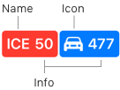
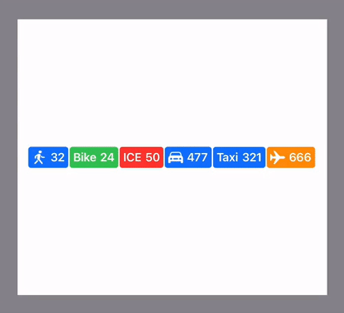

# Custom Token Layout experiment with SwiftUI and UIKit

This is an attempt to build a custom layout on top of a `TokenView` in order to get a proper arrangement for a sequence/line of token views.
The "Token View" consists of a name/title or icon and a trailing info label with a given background and foreground color and rounded corners.

The challenge for the "Token Line View":

- show token views horizontally from left to right in only one "line" (no "flow")
- try to never exceed the width of the canvas
- never shorten the first token view
- shorten the token views by dropping their trailing info label beginning with the last token first
- if all info labels where dropped, show an ellipsis at the end and drop token views (again with the last first to drop)

## Story

As SwiftUI is rendering and calculating the position of its views by means of their type/semantic declaration and modifiers, any extensive attempt to adjust especially the position of elements (e.g. if you need a custom layout) defeats the purpose of this declarative concept: injecting absolute coordinates is currently against the nature of SiftUIs layout engine and hence very "indirect".

This slightly resembls the web, where the HTML dom tree describes the relations between the content tags. Adding CSS will then guide the browsers render engine to adjust the content according to the design requirements. But for SwiftUI there is nothing like CSS, so adding layout juice is limited (and complicated).

Conceptually I would have preferred to declare SwiftUI about the dynamics of the layout approach: define cut-off thresholds within nested views or use token-view-as-a-character in a meta-font and then let it render its content like a text render engine - but that did not work so manual coordinate calculation was needed.

Coming from UIKit, juggling around with layout constraints (either on frames or by means of AutoLayout) is a common task and although it is sometimes "daunting", still it is super flexible and allows precise control of each aspect of the UI. This playground tries to evaluate the effort, tradeoffs and benefits from both side of the worlds: SwiftUI and UIKit!

## Playground

The `CustomTokenLayout.playground` works for Xcode 12 (b2) only and contains two pages: **SwitUI** and **UIKit** for its respective implementation.

### SwiftUI

For the given layout challenge, three values need to be extracted: the total canvas width, the rendered token widths and - as part of the tokens - their name/icon width. These values are stored and handed over to a render calculation which eventually re-render the tokens adjusted by size and position.

Sadly retrieving the width out of a component, storing it to a data model/view and render it again is not so easy in SwiftUI:

- a `GeometryReader` needs to read the current width of an element and sends it - by means of a predefined PreferenceKey - up into the view tree
- an `onPreferencesChange` hook can act on this event and process/store the data
- if all data is available, we can adjust the token width and position and finally
- invoke a new layout pass and guide SwiftUI to position the elements in question

In order to facilitate this layout, several data structures and extensions are needed:

- `Token` is the model to configure the views
- `TokenView` is a single token view using a `Token` as an input model
- `TokenLineView` is where the magic happens, it needs an array of `Token`s
- The `TokenBox` is a helper struct to store widths and calculate offsets and padding for rendering each token later on
- some preference keys and view extension to propagate the widths can be found at the end. The ideas here and the `MeasureBehaviour` were inspired by the awesome https://www.objc.io/books/thinking-in-swiftui/

The `TokenLineView` calls the `render` and `computeBoxes` methods for calculating the position and widths of each token for a given canvas width. As they are acting on simple value types, this should be fast but they are called often and the dumb algorithm acts in two passes:

1. draw all tokens with maximum data and if this exceeds the canvas width, shorten each token, beginning from the tail (and adhere to the rule to never drop/shorten the first token view)

2. if result is still to wide, show the trailing ellipsis and iteratively remove tokens from the tail again until it fits the canvas width

**Notes**

- As the SwiftUI rendering has a predefined but reversed order to calculate its view hierarchy, some views contain an index. This is handed over to the preferences and bubbled up so the processing of the widths knows to which box/token the width belongs to (sad but true).

- Clipping a text view is not so easy as it's either truncated head, tail or middle - it cannot be disabled and hence the text is given a negative tail padding (If clipping a label would be possible, this would simplify a lot, anybody knows a trick?)

- Aligning the token views alongside an anchor line has the advantage of lettings SwiftUI calculate the bounding box on its own, which is not the case for overlays - the anchor API is "unintuitive" but I guess the best we can get here.

- There is an implicit minimal width for a `TokenView` and `TokenLineView`...

- The `GeometryReader` should be called on a views background - if attached to the main view, I got weird sizes on the resulting container.

- `onPreferenceChange` (like all callbacks) can only be attached once to a view - still learning this by hard.

- The flexibility/amount of code is partially related to accessibility, which should work fine but please send suggestions for improvements...

### UIKit

The implementation of `TokenLineView` and `TokenView` is straight forward, with a little bit of noise about the height alignment. As expected a lot of lines are spent to setup the views sub components. As I'm more used to Storyboards, some tricks may got lost - KISS...

Caveat: the `layer.cornerRadius = TokenView.radius` line sometimes chokes with Xcode 12

## Results

Here are some preliminary results for the given implementations. Again this is a first attempt and not "the perfect" solution (neither for SwiftUI nor for UIKit), but I only wanted to get a "feeling" about the lines of code, the drag between rendering/layouting logic vs building the view tree manually and how far SwiftUI can be streched to achieve what the given custom layout needs.

- 300 LoC for SwiftUI vs ~220 LoC for UIKit (well, this is for the "headlines" only, let's dig deeper...)
- for building the plain view hierarchy only, UIKit needs ~80 LoC vs ~60 LoC for SwiftUI. I expected a bigger advantage for SwiftUI here but the numbers do not reflect the different code style and mental model: whereas in SwiftUI the "view code sequence"" very much reflects the view hierarchy with modifiers tweaking each view, UIKit is driven by your "commands" to adjust and attach the views to a hierarchy - in UIKit you can *and must* control every detail when building your view hierarchy (at least by code, if you you use Storyboards, this would add another twist to the story).
- the core `render` and `computeBoxes` code is almost the same with 50 LoC
- unsurprisingly for SwiftUI I needed an auxiliary data model `TokenBox` to store/adjust/read the coordinates throughout the render life cycle
- in SwiftUI ~80 LoC are only "glue code" to get all the sizes out of the view tree into the custom `render` method. In sharp contrast, acting on the UIView's frames is as direct as it can be in UIKit (read, adjust, write, booom)
- overall (as expected) default "layouting" and prototyping is incredibly intuitive and fast (esp. with previews) in SwiftUI
- if a given UI/UX goes beyond the system defaults, SwiftUI only "shines" where it exposes the values conceptually and as modifiers (colors, padding, etc) but digging deeper (e.g. pixel perfect positioning, aligning to "distant" views, constraining based on visual criterias) will give you headaches
- I haven't tested any new iOS 14 SwiftUI components, maybe that could help

Note: I've only touched "building a screen" here - a real apps consists of more, especially data handling, view updates, interactions - all of which is discussed in other articles...

# Version

- jul, 2020: finished first implementations

## Contact

[Oliver Michalak](mailto:oliver@werk01.de) - [omichde](https://twitter.com/omichde)
